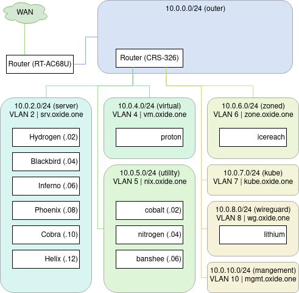

<!-- START doctoc generated TOC please keep comment here to allow auto update -->
<!-- DON'T EDIT THIS SECTION, INSTEAD RE-RUN doctoc TO UPDATE -->


- [Section 1 | Architecture](#section-1--architecture)
  - [Diagram](#diagram)
  - [Physical hosts](#physical-hosts)
  - [Virtual Hosts](#virtual-hosts)
  - [Docker Containers](#docker-containers)
- [Section 2 | Filesystem Layout](#section-2--filesystem-layout)
  - [Network Storage](#network-storage)
  - [Local Storage](#local-storage)
  - [Root filesystem](#root-filesystem)
- [Section 3 | OS Level Setup](#section-3--os-level-setup)
  - [Operating System](#operating-system)
  - [SELINUX](#selinux)
  - [Firewall](#firewall)
  - [Packages](#packages)
  - [Users](#users)
  - [SSH](#ssh)
  - [LDAP](#ldap)
- [Section 4 | Networks](#section-4--networks)
  - [Networks](#networks)
  - [Network Tools](#network-tools)
  - [Network Setup](#network-setup)
- [Section 5 | Virtualization](#section-5--virtualization)
  - [Virtual Networks](#virtual-networks)

<!-- END doctoc generated TOC please keep comment here to allow auto update -->

---

# Section 0 | About

This document is meant to define some basic documentation about the oxide.one realm. It is not meant to be used as a guide, but you can feel free to if you so wish.

**Todo**

- [ ] Virtualisation - Storage Setup

- [ ] Software

- [ ] Hostname Choices

- [ ] Architecture

---

# Section 1 | Architecture

This section will cover the overall design, as well as describe the physical hosts and their attributes. The following image gives a rundown of the hosts I will be referencing in this section.

## Diagram



## Physical hosts

I have a collection of physical hosts in the oxide.one estate. I will discuss their physcial attributes now.

### Overview

| Name      | IP        | Model   | Size | CPU            | Ram (GB) |
| --------- | --------- | ------- | ---- | -------------- | -------- |
| Hydrogen  | 10.0.2.2  | CSE-815 | 1U   | 2x E5-2620 V1  | 68       |
| Blackbird | 10.0.2.4  | CSE-825 | 2U   | 2x E5-2650 V2  | 100      |
| Inferno   | 10.0.2.6  | CSE-825 | 2U   | 2x E5-2650 V2  | 100      |
| Phoenix   | 10.0.2.8  | CSE-826 | 2U   | 2x E5-2650 V2  | 16       |
| Cobra     | 10.0.2.10 | D20     | DSK  | 2x E5-2687W V1 | 64       |
| Helix     | 10.0.2.12 | P310    | DSK  | 1x I7-4790     | 32       |

### Hydrogen

Hydrogen is the 'master node' of the estate. This server runs everything mission critical to operation of the estate. If more than 1 other service depends on something, it will live on hydrogen.

Some VMs that currently live on hydrogen:

- cobalt

- nitrogen

- banshee

Hydrogen currently operates DHCP for the oxide.one realm as well.

### Blackbird

Blackbird is a 'slave node'. It one of the 3 main workhorses of the oxide.one estate.  It serves as a ceph node, and acts as a kubernetes host. Blackbird, along with Inferno and Phoenix provide the majority of the storage across the oxide.one estate; and their configuration is kept in parallel (physically and virtually). It is connected to the network with a 10G SFP+ Link.

### Inferno

Inferno is also a 'slave node'.  It is also connected with an SFP+ Link.

### Phoenix

Phoenix is a slave node, but it is linked to the network with a QSFP+ Link to provide additional bandwidth. This is because Phoenix has more storage capability than Inferno and Blackbird, and it serves as Network storage for lithium and Plex.

### Cobra

Cobra is a Lenovo D20. It currently runs development environments, as well as Lithium.

Plex also runs on Cobra in a docker container, which is often it's main resource hog.

### Helix

Helix is the dedicated 'docker box'. It provides several key docker containers, like my blog and jenkins build server.

## Virtual Hosts

My Virtual hosts is not an exhaustive list, and it does not contain my kubernetes virtual machines.

### Overview

| Name     | IP       | Network   | Host      | vCPUS | Ram (MB) |
| -------- | -------- | --------- | --------- | ----- | -------- |
| proton   | DHCP     | virtual   | Blackbird | 6     | 2048     |
| cobalt   | 10.0.5.2 | utility   | Hydrogen  | 4     | 2048     |
| nitrogen | 10.0.5.4 | utility   | Hydrogen  | 6     | 6144     |
| banshee  | 10.0.5.6 | utility   | Hydrogen  | 6     | 2048     |
| icereach | DHCP     | zoned     | Inferno   | 6     | 4096     |
| lithium  | DHCP     | wireguard | Cobra     | 6     | 6192     |

### Proton

Proton is the server that hosts okami.dev. It lives on the *virtual* network, but should really be moved to the *zoned* network. It runs Fedora 30

### Cobalt

Cobalt is my FreeIPA server. It serves DNS and LDAP to all the networks. This is core infrastructure. It runs Fedora 30. This runs on the *utility* network. 

### Nitrogen

Nitrogen is my Mailserver running Mailcow on docker. It runs on the *utility* network.

### Banshee

Banshee runs HaProxy and proxies requests to Blackbird and Inferno, which both run Nginx in a docker container. It runs Fedora 30.

### Icereach

Icereach is my Kali Linux box.

### Lithium

Lithium is my Torrenting server. I use it to power requests.doubledash.org; as well as download linux ISO images. It runs Fedora 30.

## Docker Containers

| Name      | Image      | Host      | Port     | Purpose              |
| --------- | ---------- | --------- | -------- | -------------------- |
| Ghost     | ghost      | Helix     | 2368     | Personal Blog        |
| Portainer | portainer  | Helix     | 9000     | Docker MGMT          |
| Registry  | registry:2 | Helix     | 5000     | Docker Registry      |
| Postgres  | postgres   | Helix     | 5432     | Database for blog    |
| Gitea     | gitea      | Helix     | 22, 3000 | Git Server           |
| Jenkins   | jenkins    | Helix     | N/A      | Build Server         |
| InfluxDB  | influxdb   | Helix     | N/A      | Database for Grafana |
| Grafana   | grafana    | Helix     | N/A      | Grafana (Graphs)     |
| Redis     | redis      | Hydrogen  | Host     | Database for cloud   |
| MariaDB   | mariadb    | Hydrogen  | Host     | Database for cloud   |
| Nextcloud | custom     | Blackbird | 475      | Cloud Storage        |
| Nginx-pxy | custom     | Blackbird | 443      | Load balancer        |
| Nextcloud | custom     | Inferno   | 475      | Cloud Storage        |
| Nginx-pxy | custom     | Inferno   | 443      | Load Balancer        |
| Plex      | pms-docker | Cobra     | Host     | Plex Media           |

# Section 2 | Filesystem Layout

For all machines, physical and virtual; storage specific directories are kept in the `/str` directory. The purpose of this is to make it clear the type of storage, where it is and to root FS uncluttered.

The following directories are to be made when a system is provisioned.

`/str/loc`

`/str/net`

## Network Storage

Network based storage is kept under `/str/net`

The pattern followed for network storage is as follows:

`/str/net/{type}/{host}/{volume}`

Where `type` is the method of storage, abbreviated to 3 letters. It is good practice to keep the first character unique, so that tab completion is easier.

- Network FIle System (NFS): `/str/net/nfs`

- Gluster FS: `/str/net/gfs`

- Ceph Storage: `/str/net/cep`

`host` relates to where the storage is kept. For a NFS based storage exported on the host 'blackbird' the directory would be `/str/net/nfs/blackbird/`

`volume` relates to the name of the share/volume exported.  Continuing the previous example, for a share called `cloudinit` the full storage path is `/str/net/nfs/blackbird/cloudinit`

*Special case*

For local net storage; i.e a gluster volume mounted; use `local` as the host.

Example:  `/str/net/gfs/local/vol1`

## Local Storage

Local storage is to be mounted and kept under `/str/loc` 

The pattern for local storage is as follows:

`/str/loc/{type}/{volume}`

Where `type` is the type of storage. The naming convention for the type of storage is as follows.

- ZFS based Raid array: `ember`

- SSD based Storage: `flame`

- NVME based Storage: `blaze`
  
  This is to allow for clear identification of the type of storage, and it's relative speed. (it also looks cool)

`volume` relates to the name of the volume. For a ZFS filesystem with a volume exported as `glusterstore` the path would be as follows: `/str/loc/zfs/ember/glusterstore`

## Root filesystem

Where possible, the root filesystem externally shall be only 3 partitions. The first being a FAT32 EFI boot partition, mounted at `/boot/efi`. The size shall not exceed 500MB.

This filesystem shall be labelled "EFI"

The second filesystem shall be an EXT4 filesystem mounted at `/boot` not exceeding 10GB. This filesystem shall be named "BOOT"

The third filesystem shall be an LVM based filesystem, taking up the rest of the device. This filesystem shall be named "ROOT"

The LVM partition shall be allocated up to 50GB to the root filesystem, and the rest kept for alternate directories.

---

# Section 3 | OS Level Setup

This section covers OS level setup for both virtual machines and physical machines. Generally I keep stuff at the OS defaults, with the following changes made.

## Operating System

The base operating system shall be based on Fedora 31 unless there is a specific reason not to. This is to make system management easier across the estate.

Physical hosts use Fedora server

Virtual hosts use Fedora cloud images.

## SELINUX

Selinux is disabled on physical hosts and virtual hosts.

This can be done  by editing the file `/etc/selinux/config` and ensuring the line `SELINUX=` is `SELINUX=disabled`

## Firewall

The firewall on physical hosts is disabled. This can be done with 

```shell
systemctl stop firewalld && systemctl stop firewalld
```


## Packages

### DNF Automatic

To make package management easier, all hosts shall have dnf automatic configured and installed. 

Physical hosts shall have dnf-automatic configured to download only. Installing the packages is left up to the operator to do; which is completed on a weekly basis. 

This is done so that bringing down a physical host (and the VMs that live on it) is planned, rather than sporadic.

Virtual hosts should have dnf-automatic configured to download and install immediately. This is done because bringing down a VM won't mean bringing down an entire stack (usually).

**Setup**

`sudo dnf install -y dnf-automatic`

**For physical hosts**

`sudo systemctl enable dnf-automatic-download.timer && sudo systemctl start dnf-automatic-download.timer`

**Virtual Hosts**

`sudo systemctl enable dnf-automatic-install.timer && sudo systemctl start dnf-automatic-install.timer`

### Physical Hosts

Physical hosts require a few more packages to be installed.

When installing the system, make sure to follow the spec for system storage.

**Virtualisation**

For hosts intended to be used as virtualization hosts, they must install the virtualization group. This can be done with:

```shell
dnf group install --with-optional virtualization
```

**Motd**

For MOTD generation to work, the following packages need to be installed.

- figlet

- lolcat

This can be done with:

```shell
dnf install -y lolcat figlet
```

**Cron**

```shell
dnf install -y cronie cronie-anacron
```

**LDAP**

For LDAP to work, please install the following packages.

```shell
dnf install -y freeipa-client autoconfig
```

## Users

### Root Account

The root account is disabled.

### okami

okami is the default user setup for all systems. Every VM and Physical host should have this user existing by way of FreeIPA (LDAP).

They belong in the following groups (if they exist):

- docker

- wheel

- libvirt

### Sudo

Users in the wheel group shall have passwordless sudo enabled. This can be achieved with the following line.

` %wheel ALL=(ALL) NOPASSWD: ALL`

The following settings shall also be set in the sudoers file.

```
 Defaults env_keep += "LANG LANGUAGE LINGUAS LC_* _XKB_CHARSET"
 Defaults env_keep += "HOME"
 Defaults env_keep += "XAPPLRESDIR XFILESEARCHPATH XUSERFILESEARCHPATH"
 Defaults env_keep += "QTDIR KDEDIR"
 Defaults env_keep += "XDG_SESSION_COOKIE"
```

## SSH

SSH is the primary method of accessing any system across the estate.

Password authentication is not allowed anywhere.

`PasswordAuthentication no`

## LDAP

LDAP Through FreeIPA is to be setup and configured for each client on the network. This is to allow for easy user management across systems. This is setup using the FreeIPA ansible roles; and the home dir shall be set on creation.

### MOTD

Physical hosts should have a MOTD setup using a script. Currently they should use the script provided by [this repo](https://github.com/okamidash/motdshell)

For the script to run properly; place the script in `/usr/local/bin/dynmotd`

Then append the following line onto /etc/profile:

 `/usr/local/bin/dynmotd`

### Cron

Cron is used to handle backing up of virtual machines. 

Enable and start Cron with 

```shell
systemctl enable --now crond.service
```

Then add the following line to `/etc/anacrontab`

```shell
@daily  25 backup-machines /usr/local/bin/backupscript.sh
```

Then grab the backupscript.sh file from [this repo](https://github.com/okamidash/motdshell) and place it in /usr/local/bin/

---

# Section 4 | Networks

Section 3 covers the network layout.

## Networks

There are 9 networks that exist within the oxide.one subsystem. 

They are outlined below.

| Name       | Subnet       | DNS            | VLAN | Purpose          |
| ---------- | ------------ | -------------- | ---- | ---------------- |
| outer      | 10.0.0.0/24  | dhcp.oxide.one | 0    | Outer Network    |
| inner      | 10.0.20.0/24 | N/A            | 0    | Inner network    |
| server     | 10.0.2.0/24  | srv.oxide.one  | 2    | Physical Hosts   |
| virtual    | 10.0.4.0/24  | vm.oxide.one   | 4    | Virtual Machines |
| utility    | 10.0.5.0/24  | nix.oxide.one  | 5    | Utilities        |
| zoned      | 10.0.6.0/24  | zone.oxide.one | 6    | Untrusted Subnet |
| kube       | 10.0.7.0/24  | kube.oxide.one | 7    | Kubernetes       |
| wireguard  | 10.0.8.0/24  | wg.oxide.one   | 8    | VPN Subnet       |
| management | 10.0.10.0/24 | mgmt.oxide.one | 10   | Management       |

### Outer

The *outer* network exists on the subnet 10.0.0.0/24 and on it contains the wider network. This is the subnet which all internet bound applications traverse through.

### Inner

The *inner* network is the default network for machines that do not have a VLAN configuration setup. This network is only used when provisioning physical hosts, as they often will not have a VLAN configured, and will need access to *a* network to configure them.

### Server

The *server* network is the network for physical hosts. All physical hosts are to have an assigned, static IP address. Any machines configured on this network should be reachable by their hostname + DNS name. While DHCP does run on this network, it should not be relied upon.

### Virtual

The *virtual* network exists to serve nondescript virtual machines. Unless there is a specific reason not to; virtual machines should live on this subnet and have their IP provided by the DHCP server.

### Utility

The *utility* network is for virtual machines that serve to provide utilities to other virtual machines. Virtual machines on this network should have a static IP. Some examples of Virtual Machines that would exist on this subnet are: FreeIPA (DNS), Mail Server, HaProxy.

### Zoned

The *zoned* network is for untrusted machines. These machines do not have any access to any other networks, only to the internet. This network is used for things like Metasploitable.

### Kube

The *kube* network is for the virtual machines that underpin kubernetes clusters. They are kept outside the virtual machine network because each kubernetes cluster might also require load balancer IPs, and there might be IP address collisions if kept together.

### Wireguard

The *wireguard* network is for physical and virtual machines that require internet access through a VPN. Any machine on this network will have internet access to other networks, but any internet bound activity will go through a wireguard tunnel to a VPN provider.

### Management

The *management* network is for physical machines that expose management interfaces such as IPMI, Routers or Switches. This network has access to all other networks.

## Network Tools

### About

The DNS servers for all networks should resolve to the central DNS server located on the *utility* network.  DNS Resolution is provided by a FreeIPA server, underpinned by BIND9. The DHCP server for each network should handle DNS updates to the central DNS server; so that remembering the IP address of each machine is redundant.

### DHCP

For the *outer* network, DHCP is provided by [dnsmasq](http://www.thekelleys.org.uk/dnsmasq/doc.html) running on AsusWRT. 

For the *inner* network, DHCP is provided by [RouterOS](https://mikrotik.com/software)

For *all other* networks, DHCP is handled by the [ISC DHCP](https://www.isc.org/dhcp/) daemon (DHCPD). 

For networks handled by DHCPD, the DHCP start range will be .50-.240 to allow for flexibility for static IP addresses to be set in edge cases.

### Nsupdate

To be able to update the DNS record for each machine on the networks, the DHCP server will use nsupdate to update the record. This cannot easily be done for both the *outer* and *inner* networks, but can be done for all other networks.

An example code block is provided below for DNS updates to be sent to the DNS server. 

On the *virtual* network; the relevant code in `/etc/dhcp/dhcpd.conf` would look like the following.

```
use-host-decl-names on;
ddns-update-style interim;
key rndc-key { algorithm REDACTED; secret REDACTED; };

zone vm.oxide.one. { primary 10.0.5.2; key rndc-key; }
zone 4.0.10.in-addr.arpa. { primary 10.0.5.2; key rndc-key; }

shared-network vm {
    subnet 10.0.4.0 netmask 255.255.255.0 {
        option domain-name-servers 10.0.5.2;
        option domain-search "vm.oxide.one";
        option routers 10.0.4.1;
        option domain-name "vm.oxide.one";
        default-lease-time 86400;
        max-lease-time 86400;
        range 10.0.4.50 10.0.4.240;
    }
}
```

For this code to update successfully using the nsupdate key, FreeIPA needs to have the following line configured in it's `/etc/named.conf` 

`include "/etc/rndc.key";`

Additionally, login to the FreeIPA portal, and add the following lines into the 'BIND update policy' section of each DNS zone you want to allow DNS updates from.

`grant "rndc-key" zonesub ANY;`

## Network Setup

Networks are managed across the oxide.one realm with Network Manager.

The 'stack' shall behave as follows.

physical interface -> VLAN interface -> bridge interface.

The physical interface should retain it's original name.

The VLAN interface shall be named by the interfaces name, with '_{VLAN}'' appended to it.

The Bridge interface shall be named after the network.

Using Nmcli, you can create these interfaces using the following lines.

```shell
nmcli con add type bridge con-name zoned ifname zoned
nmcli con add type vlan con-name vlan-zoned ifname vlan-zoned dev enp131s0 id 10 master zoned slave-type bridge
```

---

# Section 5 | Virtualization

## Virtual Networks

Networks are handled differently in the oxide.one realm. Instead of using NAT for networking, bridging is preferred. This requires a bit of setup though.

For each Network (out of the 9); there needs to have a bridge interface existing on the host machine assigned to the VLAN interface.

Then, you will need to define the networks in libvirt. 

For all of the networks, except for the *virtual* network, they are to be named consistent with the network name. For example, the *zoned* network is named *zoned*.

This is to allow for less confusion, as the bridge, libvirt network and physical network will all be named the same.

The _exception_ to all this is the *virtual* network. This shall be named 'default' so that libvirt does not complain that there are no default networks.

The code to create bridged networks is as follows.

```xml
<network>
  <name>NAME</name>
  <forward mode="bridge"/>
  <bridge name="BRIDGENAME"/>
</network>
```

Where `NAME` is the name of the network, and `BRIDGENAME` is the name of the bridge.

To import the network into libvirt; run the following command.

```shell
virsh net-define ./bridge.xml
```

Additionally, you will need to set the following sysctl value.

```
net.ipv4.ip_forward = 1
```

This can be set permanently with the following line:

```shell
echo "net.ipv4.ip_forward = 1" | sudo tee /etc/sysctl.d/99-ipforward.conf
```
